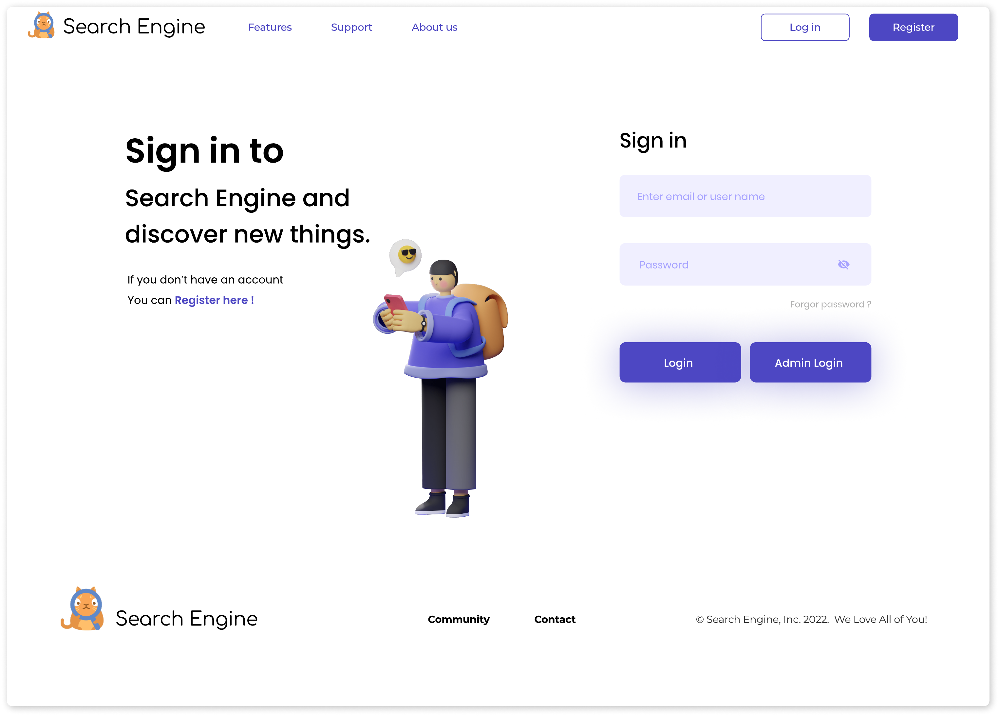
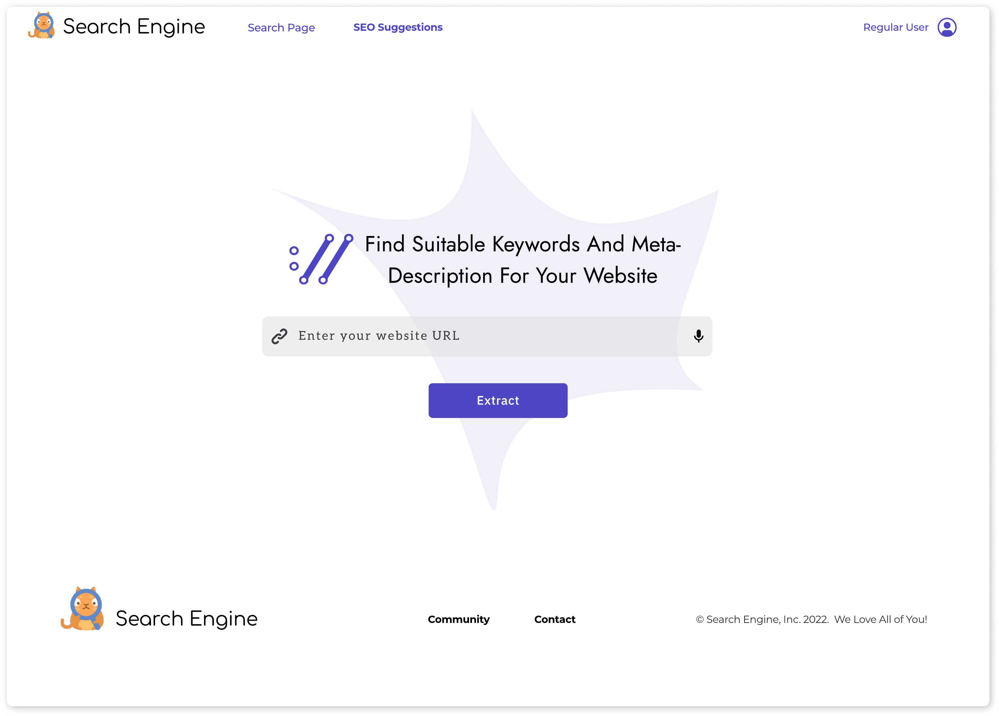

# Webpage Ranking

A software design report for Search Engine Optimization.

## Preface

Our Page Ranking Project has the basic search functionality for searching website data. Furthermore, The Page Rank Project keeps track of visited website URLs and updates that number in the database automatically when the user clicks on that website URL. Additionally, website owners can find suitable keywords and meta-description for their website. The system also has the page rank calculations feature, which is only visible to the admin.

## System Design

This design report contains the functional requirements of the system:

- User Stories
- Use Cases
- Use Case Diagram
- Entity Relationship Diagram
- Sequence Diagram
- Test Script

## Expected UI/UX Design

|                                                |                                                              |
|:----------------------------------------------:|:------------------------------------------------------------:|
|                |                                    |
|        |                            |
|            |                    |
|  |  |

## Features

- The system provides accurate results and suggestions as per users' needs.
- It also precisely describes the information that users are looking for.
- The system gives results according to the best relations between the query asked and the information.
- This makes users search for requirements in a more organized way and easily.
- Especially for website owners, this system has a new feature whereby they get suggestions from it for various suitable keywords, titles, content, etc for SEO purposes.
- Admin just has to feed URLs and metadata of the website to the database
- Saves time as it provides results instantly.

## Limitation

- Sometimes search engines give useless results that are not required by the users.
- It may also mislead the users by providing wrong results for the query they have asked.

## Applications

- The system can be used by any organization to provide the user the convenience while accessing the website.
- It can also be used by educational institutes, hospitals, or companies in their software or applications to be used by employees.
- It can be very well used by site owners for SEO suggestions.

##	 Contributors

- [@abdelkhalekalashker](https://github.com/abdelkhalekalashker)
- [@AbdeltwabMF](https://github.com/AbdeltwabMF)
- [@Abdulrhman-khalifa](https://github.com/Abdulrhman-khalifa)
- [@Abdulrhmangamal](https://github.com/)
- [@Abdelrahman-Ramadan](https://github.com/Abdelrahman-Ramadan)
- [@abdelhameed](https://github.com/)

## License

Licensed under the [MIT](LICENSE) License.
